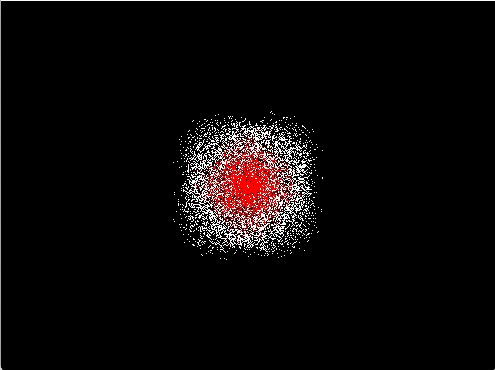

# Orbital Gravity Simulator

A high-performance 2D physics engine written in C++ and SFML. This project simulates Newtonian gravity acting on thousands of particles, featuring custom velocity integration and dynamic heat visualization based on kinetic energy.

---

**Screenshot:**

